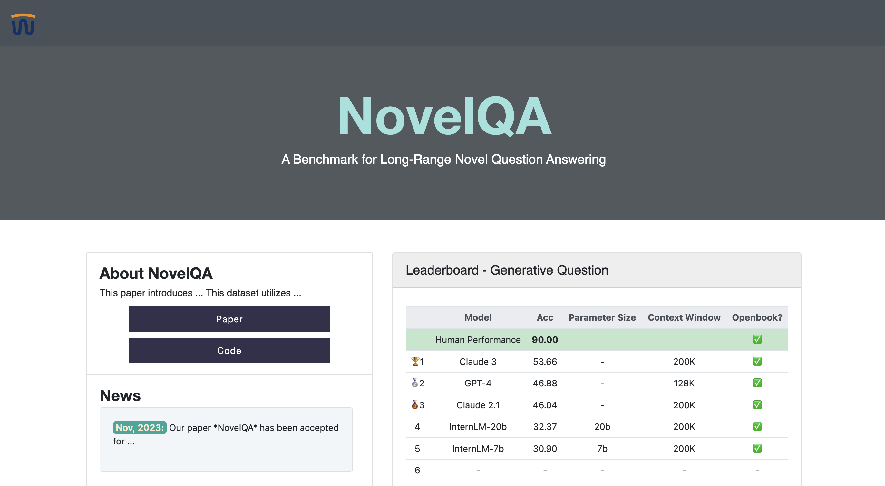
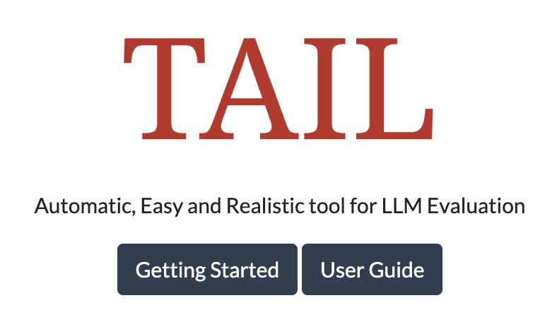
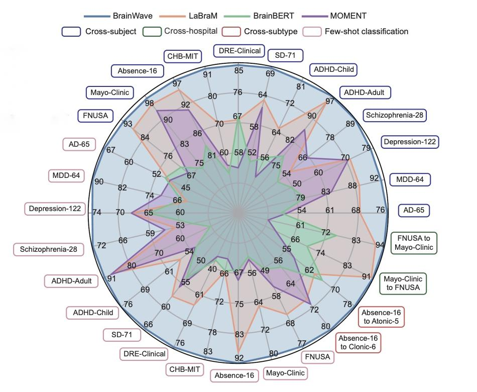








I am an undergraduate at Zhejiang University, majoring in statistics. I have worked with Prof. [Yang Yang](http://yangy.org/) and Prof. [Xiaoye Miao](https://person.zju.edu.cn/en/miaoxy_en#0) on several projects about time series mining. Currently, I am working with [YaleNLP](https://yale-nlp.github.io/) group on for LLM evaluations and information retrieval. 

I am broadly interested in natural language processing. My main interest lies in:
(1) Model Evaluation: Detecting hallucination, benchmark long-context, instruction-following abilities.
(2) Complex Reasoning: Exploring improved approaches for mathematical and domain-specific reasoning.
I'm also interested in building AI applications and expanding my research into other modalities, such as vision and sequential data.

# 🔥 News
- *2024.12*: &nbsp; Submitted a new co-first author paper to ACL Rolling Review! 
- *2024.11*: &nbsp; I am going to present our work in-person at Miami, FL on EMNLP conference!
- *2024.10*: &nbsp; New first-author paper “TAIL: A Toolkit for Automatic and Realistic Long-Context Large Language Model Evaluation" has been accepted by EMNLP 2024 (Demo Track). 
- *2024.07*: &nbsp; Start as a visiting student at Yale University, working with [Arman Cohan](https://armancohan.com/)!
- *2024.01*: &nbsp; Start my journey as an exchange student at HKUST!

# 📝 Publications

Preprint

Ref-Long: Benchmarking the Long-context Referencing Capability of Long-context Language Models

Junjie Wu*, **Gefei Gu**\*, Yanan Zheng, Dit-Yan Yeung, Arman Cohan 

EMNLP 2024 (Demo Track)

[TAIL: A Toolkit for Automatic and Realistic Long-Context Large Language Model Evaluation](https://aclanthology.org/2024.emnlp-demo.21/)

**Gefei Gu**, Yilun Zhao, Ruoxi Ning, Yanan Zheng, Arman Cohan.

[**TAIL User Guide**](https://nlp.cs.yale.edu/TAIL/) Feel free to use our toolkit!

Preprint

[BrainWave: A Brain Signal Foundation Model for Clinical Applications](https://arxiv.org/pdf/2402.10251)

Zhizhang Yuan, Fanqi Shen, Meng Li, Yuguo Yu, **Gefei Gu**, Fei Wu, Chenhao Tan, Yang Yang 

<!-- simple paper -->

# 🎖 Honors and Awards
- *2023.10* Outstanding Student, Zhejiang University
- *2023.10* First Prize Scholarship, Zhejiang University (Top 3%)

# 📖 Educations
- *2021.09 - 2025.06*, Undergraduate, Statistics. Zhejiang University, Hangzhou, China.
- *2024.01 - 2024.06*, Exchange Student, The Hong Kong University of Science and Technology, Hong Kong, China.
- *2024.07 - 2024.11*, Visiting Student, Yale University, CT, US.

# 💻 Internships
- *2023.07 - 2023.08*, Ping An Insurance (Group) Company of China, Ltd

# 🎹 Interesting Things!
- Besides study and research, I am interested in Photography and Trading. 
